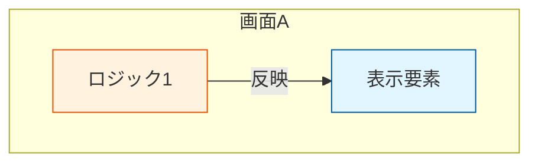

# 🧠 State Machine & UI Mapping Definition

## 🌌 Overview
本ワークフローは、実装（コード生成）に入る前に、**ロジックの全探索** と **UIとの整合性確認** を強制するための手順です。
`brief.md` や `README.md` から動作仕様を洗い出し、Mermaid記法で可視化することで、考慮漏れや矛盾を事前に防ぎます。

## ⚖️ Rules / Constraints
- **全パスの洗い出し**: 正常系だけでなく、異常系やキャンセル時の遷移も必ず描く。
- **UIマッピングの必須化**: ロジック（State）がどの画面（Screen）に属するかを紐付ける図（UI Mapping）を最後に必ず添える。
- **Mermaid構文チェック**: 生成したmermaid記述は、環境依存文字（ID内のスペースや記号）を含まないようにする。
- **配置場所**: `CONVOY_PROJECT/<productId>/docs/state_machines.md` に集約する。

---

## ✅ Inputs / Outputs

### Inputs
- `assets/branding/<productId>/brief.md`（要件定義）
- `README.md`（基本仕様）
- （あれば）`docs/products/<productId>/01_screen-inventory.md`

### Outputs
- `CONVOY_PROJECT/<productId>/docs/state_machines.md`

---

## 🚀 Workflow / SOP

### Step 1: Logic Extraction (仕様の洗い出し)
BriefやREADMEから、状態遷移を持つコンポーネント（例: タイマー、決済、認証、育成ロジック）を特定する。
箇条書きで「状態（State）」と「トリガー（Trigger）」と「遷移先（Next State）」をメモする。

### Step 2: State Machine Visualisation (図式化)
特定したコンポーネントごとに Mermaid `stateDiagram-v2` を作成する。

**Checklist:**
- [ ] 初期状態 `[*]` から終了状態 `[*]` までのパスが繋がっているか
- [ ] エラー/キャンセル時の「戻り矢印」はあるか
- [ ] ノードIDは英数字のみか（例: `Idle` OK, `Idle State` NG）
- [ ] ラベルには `"` をつけているか（例: `Idle["待機 (Idle)"]`）

### Step 3: UI & State Mapping (整合性チェック)
作成したステートマシンが、実際の画面（UI）のどこに配置されるかを `graph TD` で描く。
これにより、「ロジックはあるが画面がない」「画面はあるがロジックが未定義」の矛盾を検出する。

**Format:**


### Step 4: Documentation (ファイル化)
`CONVOY_PROJECT/<productId>/docs/state_machines.md` を作成/更新し、全ての図と解説文を記述する。

---

## 🤖 Agent Prompt (for Antigravity)
このワークフローを実行するエージェントへの指示テンプレート:

```text
あなたはアーキテクトです。
以下の手順で対象アプリのステートマシン図を作成してください。

1. BriefとREADMEを読み、ステートフルな要素（タイマー、認証、育成、課金など）を特定する。
2. Mermaid stateDiagram-v2 で遷移図を描く。
   - ノードIDは英数字のみ（スペース禁止）。
   - 日本語ラベルは必ずダブルクォートで囲む（例: id["日本語"]）。
3. 最後に「UI & State Mapping」図を描く。
   - graph TD を使い、各ロジックが「どの画面（subgraph）」に属するかを可視化する。
   - 画面とロジックの乖離がないか確認する。
4. `docs/state_machines.md` (プロジェクトルート配下のdocs) に保存する。
```


