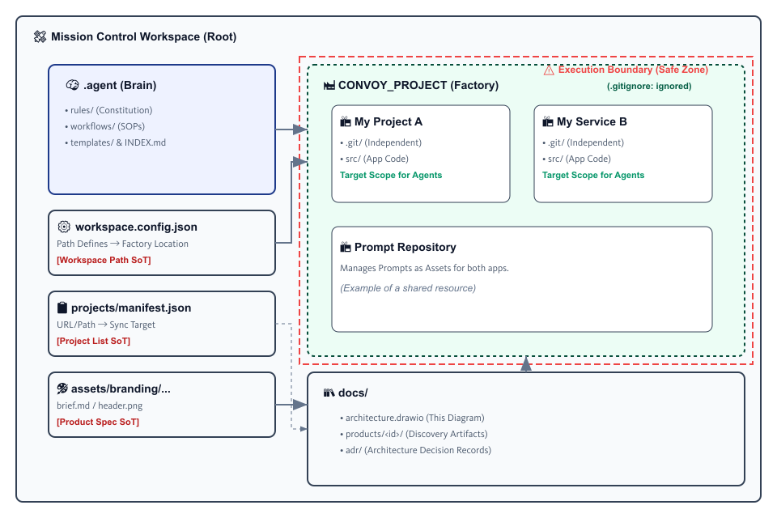

<div align="center">


# Convoy
### ～ Your Own Repository Organization Zero-gravity Utility ～


<p align="center">
  
  
  
  
</p>

**Google Antigravity エージェントと協働するための「エージェント主導開発（ADE）」ワークスペース**

[コンセプトを読む](#concept) • [使い方](#getting-started) • [開発ライフサイクル](#product-development-lifecycle) • [ワークフロー一覧](#workflow-catalog) • [管制仕様](ANTIGRAVITY_AGENT_CONTROL_SPEC.md) • [.agent/INDEX](.agent/INDEX.md)

</div>

---

## 🌌 Concept

**Convoy（司令塔）** は、単なるリポジトリ管理ツールではありません。
これは、**「反復作業の重力」から開発者を解放するための、Google Antigravity専用の管制塔（Mission Control）** です。

従来の開発環境が「コードを書く場所」であったのに対し、Convoyは「エージェントにタスクを委任し、指揮する場所」として設計されています。
`CONVOY_PROJECT` 配下に生成される全てのリポジトリは、ここで定義された **Rules（憲法）** と **Workflows（標準作業手順）** によって、統一された高品質な基準で管理されます。

### Core Philosophy
- **Automate Everything**: 初期化、コミット、リリース、品質チェックまで、あらゆるプロセスをWorkflowとして定義。
- **Agent First**: 人間が読みやすいだけでなく、AIエージェントが理解・実行しやすい構造を徹底。
- **Convoy Identity**: 機能性だけでなく、Mission Controlとしての統一感（Branding）を自動的に注入。

---

## 🚀 Getting Started

このワークスペースでは、**スラッシュコマンド（/）** を使用してエージェントに指示を出します。
複雑なプロンプトを考える必要はありません。定義済みのWorkflowを呼び出すだけで、熟練のエンジニアのような作業をエージェントが実行します。

### 基本的なコマンド（推奨導入順）

| コマンド                              | 説明                                                                                                       |
| :------------------------------------ | :--------------------------------------------------------------------------------------------------------- |
| **`/branding-intake`**                | 🧭 **企画・設計の起点**<br>製作者への問いかけからアプリ別のブランド要件（`brief.md`）を確定します。               |
| **`/setup-product-discovery`**        | 🗂️ **成果物置き場の準備**<br>棚卸し→MVP→設計を回すための `docs/products/<productId>/` を標準生成します。        |
| **`/parallel-discovery-antigravity`** | 🎛️ **並列棚卸し**<br>UI/Data/CI の3エージェントを同時稼働し、設計案を一気に洗い出します。                       |
| **`/integrate-discovery-artifacts`**  | 🧩 **統合・確定**<br>Artifactsの矛盾を解消し、Convoy docs へ収束して ADR に決定を記録します。                    |
| **`/build-app-flutter`**              | 📱 **Flutter アプリ雛形**<br>Flutterプロジェクト生成、Riverpod / go_router 導入、README反映まで標準化します。 |
| **`/build-app-simple`**               | 🏗️ **アプリ実装（Web）**<br>要件を伝えるだけで、モダンで美しいWebアプリケーションを実装します。            |
| **`/projects-sync`**                  | 🔁 **配下プロダクト同期**<br>`projects/manifest.json` を正として `CONVOY_PROJECT` 配下を clone/pull で一括更新します。 |
| **`/create-release`**                 | 📦 **リリース自動化**<br>変更差分を解析し、美しいリリースノートとヘッダー画像を生成してGitHubへ公開します。 |
| **`/create-convoy-project-complete`** | 🆕 **統合版（慣れてきたら）**<br>作成〜リリースまでを一気通貫で完了します。                                   |

---

## 🧩 Product Development Lifecycle

Convoy のワークフローは、**企画→実装→リリース** の順で迷わず進められるように設計されています。
以下は「標準順序（SoT）」です。実際のコマンド利用可否は、`.agent/workflows/` と `.agent/INDEX.md` を正とします。

### Phase 1: Inception & Discovery（企画・設計）
目的: **何を作るか**（価値・範囲・体験・データ）を固め、実装の迷いを潰す。

- `/branding-intake`（コンセプト・ブランド要件の確定。成果物: `assets/branding/<productId>/brief.md`）
- `/setup-product-discovery`（設計成果物の置き場の標準化：`docs/products/<productId>/`）
- `/parallel-discovery-antigravity`（UI / Data / CI の 3 エージェントで並列棚卸し）
- `/integrate-discovery-artifacts`（矛盾解消→Convoy標準ドキュメントへ統合）

### Phase 2: Project Setup（プロジェクト立ち上げ）
目的: **開発対象（リポジトリ／工場／資産分離）** を用意する。

- `/projects-sync`（manifest 正の同期・準備）
- `/create-repo-from-folder`（既存フォルダのリポジトリ化・標準化）
- `/create-prompt-repo`（必要時のみ：プロンプト資産の分離）

### Phase 3: Implementation（実装）
目的: **仕様（Phase 1 成果物）に基づき、骨格を作って動かす**。

- `/build-app-flutter`（Flutter 標準骨格：Riverpod / go_router）
- `/build-app-simple`（Web で素早く構築するパス）

### Phase 4: Development & Quality（開発・品質維持）
目的: **日々の変更を安全に積み上げ、品質を落とさない**。

- `/git-auto-commit`（差分根拠で適切な粒度のコミット）
- `/visualize-architecture`（現状可視化：図の自動生成）
- `/review-repo-quality`（README/CI/構造の健康診断）
- `/update-convoy-identity`（README/画像/導線の整流化）

### Phase 5: Release（リリース）
目的: **公開可能な形に整えて出荷**。

- `/generate-header-image`（ストア／SNS／README 用のヘッダー画像生成）
- `/create-release`（SemVer 付与→Release 作成）

### Special: Integrated Flow（統合）
- `/create-convoy-project-complete`（上記のプロセス（作成〜リリース）を一気通貫で実行する統合ワークフロー。慣れてきたらこれ一本で管理可能）

---

## 📂 Architecture

Convoyは、複数のプロジェクトを統括する「メタ・ワークスペース」として機能します。

<picture>
  <source type="image/svg+xml" srcset="docs/architecture.svg">
  
</picture>

```text
d:/Prj/Convoy/                 <-- 🛰️ Mission Control (Current)
├── .agent/                    <-- 🧠 Agent Brain
│   ├── rules/                 <-- 憲法 (Coding Standards, Branding Rules)
│   ├── workflows/             <-- 手順書 (SOPs)
│   └── templates/             <-- 定型テンプレ
│
├── CONVOY_PROJECT/            <-- 🏭 Project Factory
│   ├── my-cool-project/       <-- 📦 Generated Repo 1
│   ├── another-service/       <-- 📦 Generated Repo 2
│   └── prompt-repo/           <-- 📦 Prompt Management
│
└── ANTIGRAVITY_AGENT_CONTROL_SPEC.md <-- 📜 管制仕様（Control Spec）
```

- **Mission Control**: あなたはここで指令を出します。
- **Project Factory**: エージェントは `CONVOY_PROJECT` ディレクトリ内に成果物を生成します。
- **Agent Brain**: エージェントの行動指針は全て `.agent` 内に集約されており、ここを修正するだけで全プロジェクトの挙動を調整できます。

### 🛡️ Safety & Boundaries (安全機構)

Convoyは複雑な操作を自動化するため、強力な安全装置（Safety Guards）を設けています。

#### 1. Single of Truth (SoT) の分離
情報の混乱を防ぐため、以下の通り「正本（Source of Truth）」を明確に分離しています。

- **Project List SoT**: [projects/manifest.json](projects/manifest.json) (リポジトリのURL・パス管理)
- **Workspace Path SoT**: [workspace.config.json](workspace.config.json) (Project Factoryの物理パス定義)
- **Product Spec SoT**: `assets/branding/<productId>/brief.md` (各アプリの仕様・ブランド定義)

#### 2. Nested Git Strategy (入れ子リポジトリ)
`CONVOY_PROJECT/` 配下のプロダクトは、Mission Control (Convoy) とは**完全に独立したGitリポジトリ**として管理されます。
- Convoy側 `.gitignore` で `CONVOY_PROJECT/` を除外済みです（誤コミット防止）。
- エージェントは**「指定された単一のプロジェクト」にスコープを限定して**作業を行います。


---

## 📚 Workflow Catalog

利用可能な全ワークフロー（標準作業手順書）の一覧です。

> 一覧の正本は [.agent/INDEX.md](.agent/INDEX.md) です（自動生成テーブル含む）。

### 🧭 Inception & Discovery (企画・設計)
- **[🎛 Branding Intake](.agent/workflows/branding-intake.md)**: 製作者への問いかけからアプリ別ブランディング（brief.md）を確定。
- **[🗂 Setup Product Discovery](.agent/workflows/setup-product-discovery.md)**: 置き場（Docs/Decisions）を標準生成し、成果物の収束点を固定。
- **[🧭 Parallel Discovery (Antigravity)](.agent/workflows/parallel-discovery-antigravity.md)**: UI/Data/CI の並列棚卸しを Manager で実行。
- **[🧩 Integrate Discovery Artifacts](.agent/workflows/integrate-discovery-artifacts.md)**: 矛盾解消→docs収束→ADR記録で設計確定。

### 🏗️ Project Setup (立ち上げ)
- **[🔁 Projects Sync (Polyrepo / CONVOY_PROJECT)](.agent/workflows/projects-sync.md)**: manifest を正として配下プロダクトを clone/pull で一括同期。
- **[📂 Create Repo from Folder](.agent/workflows/create-repo-from-folder.md)**: 既存フォルダのリポジトリ化。
- **[🧠 Create Prompt Repo](.agent/workflows/create-prompt-repo.md)**: プロンプト管理専用リポジトリの作成。

### 💻 Implementation (実装)
- **[🏗️ Build App Simple](.agent/workflows/build-app-simple.md)**: 高速なプロトタイプ・アプリ開発。
- **[📱 Build App Flutter](.agent/workflows/build-app-flutter.md)**: Flutterアプリ雛形の生成と初期品質の標準化。

### 🛡️ Development & Quality (開発・品質)
- **[💾 Git Auto Commit](.agent/workflows/git-auto-commit.md)**: 粒度の細かいコミットとブランチ管理の自動化。
- **[🛰️ Visualize Architecture](.agent/workflows/visualize-architecture.md)**: Draw.io でアーキテクチャ図を生成。
- **[✅ Review Repo Quality](.agent/workflows/review-repo-quality.md)**: リポジトリの健康診断と改善提案。
- **[🌸 Update Convoy Identity](.agent/workflows/update-convoy-identity.md)**: 既存リポジトリを「Convoy」ブランドへ改装。

### 🎨 Branding & Assets (意匠)
- **[🎨 Generate Header Image](.agent/workflows/generate-header-image.md)**: 記事やREADME用のヘッダー画像生成。

### 📦 Release (リリース)
- **[🚀 Create Release](.agent/workflows/create-release.md)**: バージョニングとリリースノート生成。

### 🚀 Integrated Flow（統合）
- **[🚀 Create Convoy Project Complete](.agent/workflows/create-convoy-project-complete.md)**: 作成〜リリースの統合版。

---

## 🧱 Stack Policy（方針の正本）

本プロジェクトのスタック判断は、**/branding-intake で確定する `assets/branding/<productId>/brief.md` を唯一の正本（SoT）**とします。

- **スマホアプリ（iOS/Android）**: Flutter 推奨（状態管理: Riverpod / ルーティング: go_router を統一）
- **Webアプリ**: React 標準（例外可）
- **iOS運用**: ビルド/署名は macOS（Xcode）で実施（CIは必要時のみ macOS）

---

## ⚖️ Rules & Policies

エージェントは管制仕様（[ANTIGRAVITY_AGENT_CONTROL_SPEC.md](ANTIGRAVITY_AGENT_CONTROL_SPEC.md)）と、以下のルール（[`.agent/rules`](.agent/rules/)）に従って自律的に判断を行います。

- **Repo Creation Rule**: 新規リポジトリ作成時は、自動的にConvoy標準の `.gitignore` とディレクトリ構成を適用。
- **Branding Rule**: 「Mission Control」らしい工業的・高可読なデザインと言葉遣いを優先（アプリ別の詳細は `assets/branding/<productId>/brief.md` を正とする）。
- **Safety First**: 破壊的なコマンド実行前には必ず確認を求め、安全性を担保。

---

<div align="center">

*Empowered by Google Antigravity & Gemini*
<br>
*Crafted with ❤️ in the Zero-gravity Zone*

</div>
